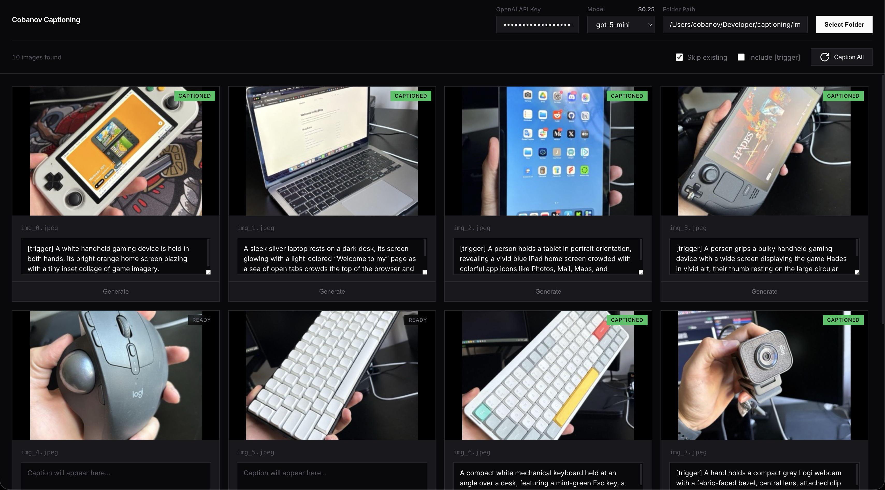

# Cobanov Captioning

AI-powered image captioning tool using OpenAI vision models.



## Quick Start

```bash
uv sync
python run.py
```

Open `http://localhost:8000` (or your local IP on port 8000)

## Usage

1. Enter your OpenAI API key
2. Select a folder with images
3. Click "Generate" or "Caption All"

Captions are saved as `.txt` files next to each image.

## API Endpoints

| Method | Endpoint | Description |
|--------|----------|-------------|
| POST | `/api/select-folder` | Open native folder picker (macOS) |
| POST | `/api/scan` | Scan folder for images |
| GET | `/api/image` | Serve image by path |
| POST | `/api/caption` | Generate caption for image |
| POST | `/api/save` | Save caption to file |